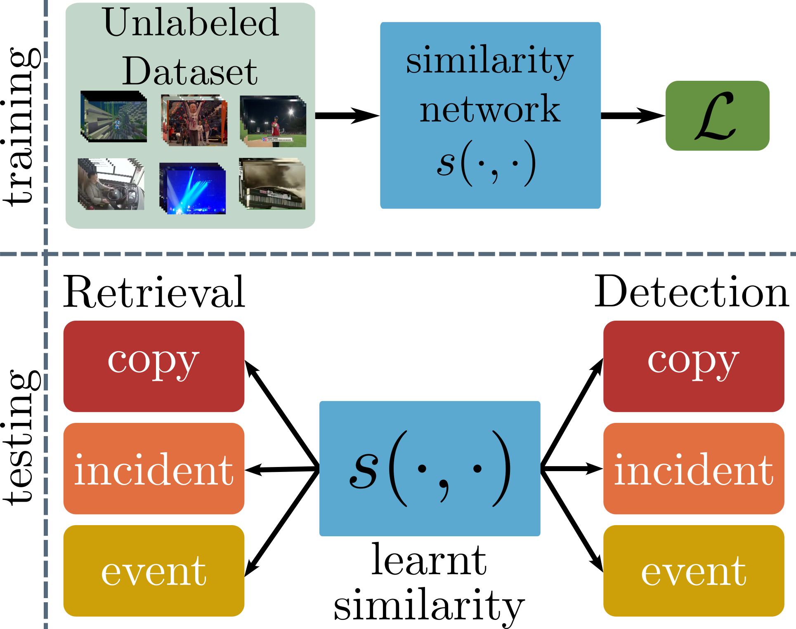

# Self-Supervised Video Similarity Learning
This repository contains the PyTorch implementation of the paper
[Self-Supervised Video Similarity Learning](https://arxiv.org/abs/2304.03378).
It contains code for the training of video similarity learning network with self-supervision. 
Also, to facilitate the reproduction of the paper's results, the evaluation code, the extracted features for the 
employed video datasets, and pre-trained models are provided.

<p align="center">

</p>

## Prerequisites
* Python 3
* PyTorch
* Torchvision
* FFMpeg

## Preparation

### Installation

* Clone this repo
```bash
$ git clone git@github.com:https://github.com/gkordo/s2vs.git
$ cd s2vs
```

* Install the required packages
```bash
$ pip install -r requirements.txt
```


## Training

* Extract the frames from the videos in the dataset used for training.
```bash
$ ffmpeg -nostdin -y -vf fps=1 -start_number 0 -q 0 ${video_id}/%05d.jpg -i <path_to_video>
```

* Edit [`scripts/train_ssl.sh`](scripts/train_ssl.sh) to configure the training session.

* Choose the augmentation types you want to include during training by providing the appropriate values to the 
`--augmentations` argument. Provide a string that contains `GT` for Global Transformations, `FT` for Frame Transformations
`TT` for Temporal Transformations and `ViV` for Video-in-Video.

* Run the script as follows
```bash
$ bash scripts/train_ssl.sh
```

* Once the training is over, a `model.pth` file will have been created in a path based on the provided `experiment_path` argument.

## Evaluation

* Download the datasets from the original sources:
    * [FIVR-5K, FIVR-200K](https://ndd.iti.gr/fivr/) - Fine-grained Incident Video Retrieval ([features](https://mever.iti.gr/s2vs/features/fivr_5k.hdf5), [features](https://mever.iti.gr/s2vs/features/fivr_200k.hdf5))
    * [VCDB](https://fvl.fudan.edu.cn/dataset/vcdb/list.htm) - Video Copy Detection ([features](https://mever.iti.gr/s2vs/features/vcdb.hdf5))
    * [EVVE](http://pascal.inrialpes.fr/data/evve/) - Event-based Video Retrieval ([features](https://mever.iti.gr/s2vs/features/evve.hdf5))

* Determine the pattern based on the video ids that video files are stored, e.g. `{id}/video.*` if it follows the pattern:
```
Dataset_dir
├── video_id1
│   └── video.mp4
├── video_id2
│   └── video.flv
│     ⋮
└── video_idN
    └── video.webm
```

* Run the [`evaluation.py`](evaluation.py) script to evaluate a trained model.
```bash
$ python evaluation.py --dataset FIVR-200K --dataset_path <path_to_dataset> --pattern '{id}/video.*' --model_path <path_to_model>
```
or run the script with the provided features
```bash
$ python evaluation.py --dataset FIVR-200K --dataset_hdf5 <path_to_hdf5> --model_path <path_to_model>
```

* If no value is given to the `--model_path` argument, then the pretrained `s2vs_dns` model is used.

## Use our pretrained models
* Usage of the model is similar as in [ViSiL](https://github.com/MKLab-ITI/visil/tree/pytorch#use-visil-in-your-python-code) and [DnS](https://github.com/mever-team/distill-and-select#use-our-pretrained-models)

* Load our pretrained models as follows:
```python
from model.feature_extractor import FeatureExtractor
from model.similarity_network import SimilarityNetwork

feat_extractor = FeatureExtractor['RESNET'].get_model(dims=512)
s2vs_dns = SimilarityNetwork['ViSiL'].get_model(pretrained='s2vs_dns')
s2vs_vcdb = SimilarityNetwork['ViSiL'].get_model(pretrained='s2vs_vcdb')
```

## Citation
If you use this code for your research, please consider citing our papers:
```bibtex
@inproceedings{kordopatis2023s2vs,
  title={Self-Supervised Video Similarity Learning},
  author={Kordopatis-Zilos, Giorgos and Tolias, Giorgos and Tzelepis, Christos and Kompatsiaris, Ioannis and Patras, Ioannis and Papadopoulos, Symeon},
  booktitle={Proceedings of the IEEE/CVF Conference on Computer Vision and Pattern Recognition Workshops},
  year={2023}
}

@inproceedings{kordopatis2019visil,
  title={{ViSiL}: Fine-grained Spatio-Temporal Video Similarity Learning},
  author={Kordopatis-Zilos, Giorgos and Papadopoulos, Symeon and Patras, Ioannis and Kompatsiaris, Ioannis},
  booktitle={Proceedings of the IEEE/CVF International Conference on Computer Vision},
  year={2019}
}
```
## Related Projects

**[DnS](https://github.com/mever-team/distill-and-select)** - computational efficiency w/ selector network

**[ViSiL](https://github.com/MKLab-ITI/visil)** - original ViSiL approach

**[FIVR-200K](https://github.com/MKLab-ITI/FIVR-200K)** - download our FIVR-200K dataset

## License
This project is licensed under the MIT License - see the [LICENSE](LICENSE) file for details


## Contact for further details
Giorgos Kordopatis-Zilos (kordogeo@fel.cvut.cz)
